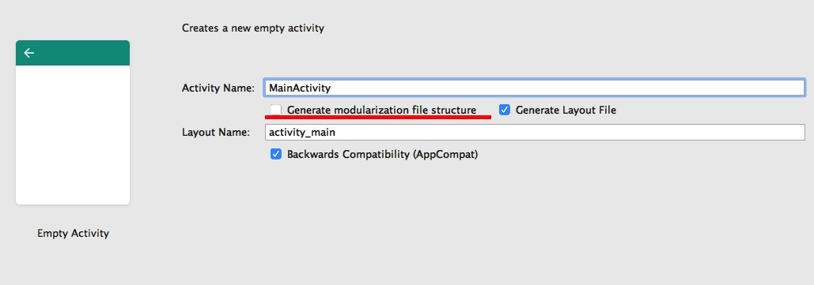

#Android Studio内置模板文件位置

AS安装目录/Contents/plugins/android/lib/templates


#注意事项

拷贝文件前请先备份AS安装目录/Contents/plugins/android/lib/templates目录下的所有文件，以免拷贝后出现问题无法还原。

如果你是新建Project而非新建Module，可能会出现build.gradle文件格式化错误的问题，这个可能是AS的bug。

正确的代码：

```groovy
sourceSets {
    main {
        if (isDebug.toBoolean()) {
            manifest.srcFile 'src/main/debug/AndroidManifest.xml'
        } else {
            manifest.srcFile 'src/main/release/AndroidManifest.xml'
            java {
                exclude 'debug/**'
            }
        }
    }
}
```

格式化错误后的代码：

```groovy
sourceSets {
    main if (isDebug.toBoolean()) {
            manifest.srcFile 'src/main/debug/AndroidManifest.xml'
        } else {
            manifest.srcFile 'src/main/release/AndroidManifest.xml'
            java {
                exclude 'debug/**'
            }
        }
}
```

主要就是main后面的闭包花括号不见了，这个手动添加一下就行。


#如何使用Modularization模板

1.将activities目录下的Modularization目录拷贝到AS安装目录/Contents/plugins/android/lib/templates/activities目录下。

2.将activities/EmptyActivity目录下的recipe.xml.ftl和template.xml拷贝到/Contents/plugins/android/lib/templates/activities/EmptyActivity目录下。

注意拷贝目录中存在同名文件，覆盖即可。

3.将ModularizationModule目录里的build.gradle.ftl拷贝到AS安装目录/Contents/plugins/android/lib/templates/gradle-projects/NewAndroidModule/root下。

4.将ModularizationModule目录里的recipe.xml.ftl拷贝到AS安装目录/Contents/plugins/android/lib/templates/gradle-projects/NewAndroidModule/root下。

注意拷贝目录中存在同名文件，覆盖即可。

5.将NewAndroidProjects目录下的gradle.properties.ftl拷贝到AS安装目录/Contents/plugins/android/lib/templates/gradle-projects/NewAndroidProject/root目录下。

注意拷贝目录中存在一个同名文件，覆盖即可。

6.重启AS，新建Project或者Module后到了新建Activity界面选择EmptyActivity，并且勾选Generate modularization file structure:

 

注意如果你选择了AndroidLibrary或者Add No Activity，Module的文件结构将是原生的文件结构：

src/main/java/package_name

而并非组件化Module的文件结构:

src/main/debug

src/main/release

src/main/java/debug

src/main/java/package_name

Build.gradle文件也将是原声的代码。

这种情况下需要你手动去调整文件结构和代码，所以推荐选择Android Application和EmptyActivity（这种组合能满足99%的需求）。